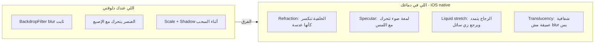
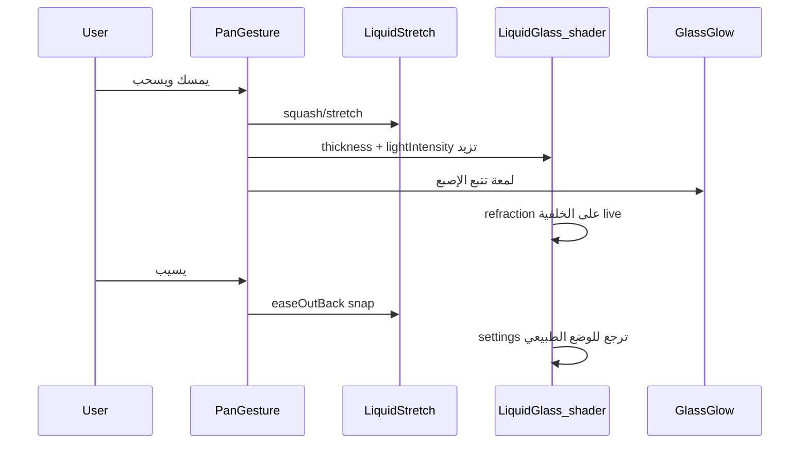

# خطة تحويل Liquid Glass لشكل iOS Native

## فهمي لقصدك (تأكيد)

أنت عايز التأثير اللي Apple سمّته **Liquid Glass** في iOS 26:




**الحركة شغالة** — المشكلة في **المادة الزجاجية نفسها**: `BackdropFilter` + gradient شفاف = frosted glass، مش liquid glass.

---

## التشخيص من الكود الحالي


| الملف                                                                                                  | اللي شغال                                      | اللي ناقص                                          |
| ------------------------------------------------------------------------------------------------------ | ---------------------------------------------- | -------------------------------------------------- |
| `[lib/widgets/media/liquid_interactive_button.dart](lib/widgets/media/liquid_interactive_button.dart)` | drag + rubber-band + snap-back + ghost outline | refraction، specular، liquid deformation           |
| `[lib/screens/duck_app_screen.dart](lib/screens/duck_app_screen.dart)`                                 | pill draggable في bottom nav + sub-tabs        | الـ pill لونه `goldColor` صلب، الـ track blur ثابت |
| `[lib/widgets/glass_panel.dart](lib/widgets/glass_panel.dart)`                                         | frosted panel                                  | أي refraction أو touch glow                        |
| `[lib/widgets/media/duck_player_overlay.dart](lib/widgets/media/duck_player_overlay.dart)`             | circular glass buttons                         | نفس المشكلة — blur بدون انكسار ضوء                 |
| `[lib/widgets/media/mini_player.dart](lib/widgets/media/mini_player.dart)`                             | frosted bar                                    | liquid interaction                                 |


مثال على الفجوة — الـ pill الحالي **لون ذهبي صلب** مش زجاج سائل:

```4240:4262:lib/screens/duck_app_screen.dart
                  child: Container(
                    decoration: BoxDecoration(
                      borderRadius: BorderRadius.circular(24),
                      gradient: !useLiquidEffects ? null : LinearGradient(...),
                      color: goldColor,  // <-- solid fill, not glass
                      boxShadow: [...],
                    ),
                  ),
```

---

## الحل التقني المقترح

### لماذا `liquid_glass_plus`؟

- يستخدم **fragment shaders** على Impeller (الافتراضي على iOS في Flutter 3.10+)
- يوفر: `LiquidGlassLayer` + `LiquidGlass` + `GlassGlow` + `LiquidStretch`
- يحقق **refraction** (انكسار الخلفية) + **frost** + **specular lighting** + **touch glow**
- iOS-only scope مناسب — Impeller شغال native على iOS

```yaml
# pubspec.yaml
dependencies:
  liquid_glass_plus: ^0.3.2
```

### Primitive موحّد جديد

إنشاء `[lib/widgets/duck_liquid_glass.dart](lib/widgets/duck_liquid_glass.dart)` كطبقة abstraction:

- `DuckLiquidGlassLayer` — wrapper حول `LiquidGlassLayer` بإعدادات Duck الافتراضية
- `DuckLiquidGlassSurface` — شكل (pill / circle / panel) + child
- `DuckLiquidGlassDraggable` — يجمع: pan gesture + `LiquidStretch` + `GlassGlow` + dynamic settings أثناء السحب
- **iOS gate**: على Android يرجع للـ implementation الحالي (مش هنلمسه)
- **reduce motion gate**: يحتفظ بـ `MediaQuery.disableAnimationsOf` ويرجع frosted fallback

إعدادات مقترحة للبداية (تتظبط بالتجربة):

```dart
const LiquidGlassSettings(
  thickness: 18,
  frostIntensity: 12,
  glassColor: Color(0x33FFFFFF),
  refractiveIndex: 1.45,
  lightIntensity: 1.4,
  outlineIntensity: 0.6,
  saturation: 1.15,
)
```

### شرط معماري مهم

`liquid_glass_plus` يحتاج **محتوى خلف الزجاج** في `Stack` عشان الـ refraction يشتغل. لازم نتأكد إن:

- الـ bottom nav والـ sub-tabs فوق الـ scrollable content (غالباً موجود)
- الـ player overlay فوق الـ thumbnail/blurred backdrop (موجود في `[duck_player_overlay.dart](lib/widgets/media/duck_player_overlay.dart)`)

---

## مراحل التنفيذ

### المرحلة 1: البنية التحتية

- إضافة `liquid_glass_plus` في `[pubspec.yaml](pubspec.yaml)`
- إنشاء `[lib/widgets/duck_liquid_glass.dart](lib/widgets/duck_liquid_glass.dart)` بالـ primitives المذكورة
- تحديث `[lib/widgets/glass_panel.dart](lib/widgets/glass_panel.dart)` ليستخدم الـ primitive الجديد على iOS

### المرحلة 2: Bottom Nav + Sub-tabs (أعلى أولوية بصرية)

في `[lib/screens/duck_app_screen.dart](lib/screens/duck_app_screen.dart)`:

- **الـ track**: `LiquidGlass` بشكل `LiquidRoundedSuperellipse(borderRadius: 28)` بدل `BackdropFilter`
- **الـ active pill**: `LiquidGlass` بـ `glassColor` ذهبي شفاف (`0x66FFC52F`) بدل `color: goldColor` الصلب
- أثناء السحب: رفع `thickness` + `lightIntensity` + `LiquidStretch(stretch: 0.4)`
- `GlassGlow` يتبع موقع الإصبع على الـ pill
- الإبقاء على rubber-band math و `easeOutBack` snap الموجودين

### المرحلة 3: Media Player Controls

- إعادة كتابة `[lib/widgets/media/liquid_interactive_button.dart](lib/widgets/media/liquid_interactive_button.dart)` ليستخدم `DuckLiquidGlassDraggable` بدل `BackdropFilter` اليدوي
- تحديث `_buildCircularGlassButton` و `_buildCapsuleGlassContainer` في `[lib/widgets/media/duck_player_overlay.dart](lib/widgets/media/duck_player_overlay.dart)`
- تحديث `[lib/widgets/media/mini_player.dart](lib/widgets/media/media_slider.dart)` بنفس النمط

### المرحلة 4: ضبط وتلميع

- Tune per-component: nav pill vs player buttons vs panels
- اختبار على iOS Simulator/Device (iOS 18+)
- Performance: تقليل عدد `LiquidGlassLayer` المنفصلة (layer واحدة لكل منطقة، مش layer لكل زر)

---

## ما هنقدر نوصله vs حدود Flutter


| ممكن نوصله                             | صعب / مستحيل 100%                                 |
| -------------------------------------- | ------------------------------------------------- |
| Refraction + frost + specular          | مطابقة pixel-perfect لـ UIKit system APIs         |
| Touch glow + liquid stretch            | Cross-widget morphing (زجاج بيتداخل مع زجاج تاني) |
| Drag physics الموجودة + glass response | نفس أداء iOS 26 على أجهزة قديمة                   |


Apple بتعمل Liquid Glass في system compositor — Flutter لازم يعملها بـ shaders. النتيجة هتكون **قريبة جداً** من iOS native، مش clone حرفي.

---

## مخطط التدفق بعد التعديل




