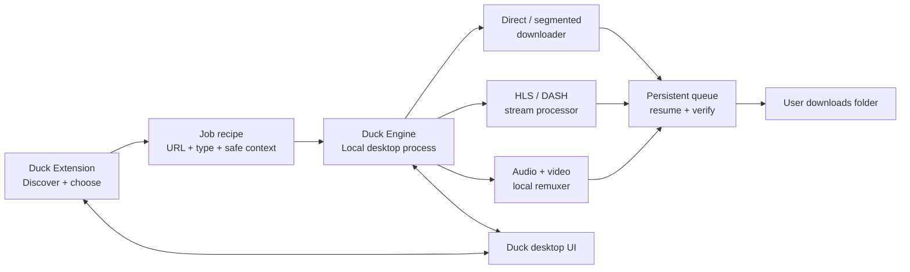

# Duck Download Manager — Product & Architecture Plan

## Goal

Build Duck as a genuine local download manager, not merely a browser video-downloader extension.

The browser extension is Duck's **eyes and control surface**: it discovers downloadable resources in pages and network traffic, lets the user choose what to save, and displays progress. A local **Duck Engine** owns the download itself: persistence, resume, parallel transfers, stream assembly, validation, and file organisation.

No cloud server belongs on the critical download path. Downloads should remain private and usable when the backend is unavailable.

## Product principle

> Duck should make every publicly accessible, non-DRM resource that the browser can legitimately obtain easier to discover, download, resume, verify, and organise than the browser's built-in downloader.

Duck does not promise to bypass DRM, private-access controls, authentication boundaries, or platform restrictions. Protected media gets a clear explanation rather than a misleading generic error.

## Target architecture



### Responsibilities

| Component | Responsibility | Must not do |
|---|---|---|
| Duck Extension | Detect resources; identify the page/post; let users choose quality/items; send a job recipe; show queue state | Hold long downloads or depend on a remote download backend |
| Duck Engine | Persist jobs; download; resume; use safe parallelism; process clear streams; validate and organise files | Expose a public network API or send user resources to a cloud service |
| Duck Desktop UI | Manage queue, history, folders, limits and troubleshooting | Require the browser to stay open for an existing job |
| Optional backend | Only non-critical future services, such as opt-in settings sync or signature updates | Be required to complete a download |

## The job recipe

The extension must send structured context to the Engine, rather than a bare URL:

```text
JobRecipe
- originating page URL and tab ID
- resource URL or manifest URL
- resource class: direct, HLS, DASH, paired tracks, bundle, live, unsupported
- suggested filename, media type and estimated size
- selected quality / format / audio-only choice
- safe request context required for the download (for example, permitted referer data)
- source capture time and expiry information when known
- bundle/post identity to prevent duplicates
```

The Engine owns the durable job record; it is never stored only in an extension service worker.

## Job state machine

```text
Detected → Queued → Preparing → Downloading → Verifying → Completed
                          │             │
                          ├→ Waiting for source refresh
                          ├→ Retrying (backoff)
                          └→ Unsupported / Protected / Needs user action
```

The UI must always explain the next available action. It should never display an unhelpful bare "Error".

## Download engines

### 1. Direct files

Supports HTTP/HTTPS downloads including video, audio, images, documents, archives and general files.

- Inspect response metadata: final URL, MIME type, filename, size, redirects and Range support.
- Use segmented downloads only when the host safely supports byte ranges.
- Persist per-part completion state and resume only the missing ranges.
- Respect host and global connection limits; more threads are not always faster.
- Download into a temporary file and atomically rename only after validation.

### 2. HLS (clear/unprotected)

- Detect and parse `m3u8` master and media playlists.
- Present resolution, bitrate, audio and subtitle choices when available.
- Fetch segments in a safe bounded queue, preserve playlist order, then create a playable output.
- Support starting a live recording from the moment the user presses download, with explicit duration and size limits.

### 3. DASH (clear/unprotected)

- Parse `mpd` manifests and show compatible video/audio combinations.
- Download selected tracks and remux locally without re-encoding when possible.
- Confirm the output opens before marking it complete.

### 4. Paired media tracks

When video and audio arrive separately, download both concurrently and remux locally. Never silently claim completion after only one track succeeds.

### 5. Bundles

Treat galleries, carousels and playlists as a parent job with individually resumable child jobs. Users can choose one item or download all.

## Discovery logic in the extension

Three sources merge into one normalized candidate list:

| Layer | Purpose |
|---|---|
| DOM scanner | Finds visible direct media and download links quickly |
| Network observer | Detects actual media, manifests and files requested by the active page |
| Site adapters | Adds reliable post identity, titles, carousel enumeration and appropriate button placement |

Candidates are de-duplicated by canonical resource/post identity, then classified. The UI shows a single best default plus an advanced source list only when needed.

## Reliability rules

- Every job is stored locally before any transfer begins.
- Browser closure, extension worker suspension, Engine restart and temporary network loss must preserve jobs.
- Retry only retriable failures, with progressive backoff: 5 seconds, 30 seconds, 2 minutes, then wait for a source refresh.
- If a short-lived source URL expires, ask the extension to re-capture it from the currently open source page; do not restart blindly.
- Check completed files by size and media/file validity, not only an HTTP success code.
- Detect HTML error pages returned in place of expected media.
- Never redownload already verified files without the user's explicit instruction.
- Give users a clear action for disk-full, missing source tab, authentication-required, unsupported format and protected media states.

## UX

- **Floating Duck button:** appears only when a useful resource exists on the page.
- **Popup:** one action—"Download best version"—with quick quality/audio choices.
- **Side panel:** candidates, bundles, active queue, retry status, history and site preferences.
- **Desktop UI:** queue controls, destinations, scheduler, connection/speed limits and diagnostic logs.
- **Site profiles:** remember preferred quality, format, destination and whether to ask before downloading.
- **Human status messages:** explain what Duck changed or needs, e.g. "The temporary link expired; Duck is refreshing it from the open page."

## Execution roadmap

### Phase 0 — Contract and boundaries

Define `JobRecipe`, persistent job schema, Engine↔Extension communication contract, supported states and no-DRM boundary.

**Exit criterion:** stable TypeScript/Rust/Dart-neutral JSON schema and explicit error/action catalogue.

### Phase 1 — Local Duck Engine MVP

Build the Engine with a local persistent queue, direct HTTP download, pause/resume, per-host/global limits, temporary files, validation and history.

**Exit criterion:** a large direct file can be paused, browser-closed, Engine-restarted, and resumed without starting again.

### Phase 2 — Extension-to-Engine bridge

Implement an authenticated, local-only bridge (Native Messaging is the preferred Chrome path). Update the existing extension to submit recipes and render Engine state.

**Exit criterion:** a direct file selected in the extension is controlled and completed by the Engine.

### Phase 3 — Product-grade direct downloads

Add automatic Range probing, segmented transfers, duplicate detection, naming rules, folders, bandwidth controls and polished queue/history UI.

**Exit criterion:** direct downloads are more recoverable and controllable than the browser default downloader.

### Phase 4 — Clear streaming formats

Add HLS first, then DASH, then paired audio/video remuxing. Keep each handler isolated behind a shared job interface.

**Exit criterion:** verified playable output for direct media, clear HLS and clear DASH samples.

### Phase 5 — Broad discovery

Harden network discovery and add site adapters in user-value order: Instagram, X, Reddit, then others based on real usage.

**Exit criterion:** one clean user-facing candidate per resource across ordinary pages, SPAs and multi-item posts.

### Phase 6 — Advanced manager features

Add live recording, download scheduling, import/paste URLs, batch rules, exportable diagnostics, and optional desktop integrations.

## Test matrix

Before claiming reliability, test each download class against:

1. Normal completion.
2. Browser closure during transfer.
3. Engine restart during transfer.
4. Network outage and recovery.
5. Expired temporary URL.
6. Partial-range failure.
7. Disk full.
8. Duplicate filename/content.
9. Invalid media returned as HTML/error content.
10. Protected/unsupported media response.

## Claude brief — direction for the next implementation work

We are changing direction from a self-contained browser downloader to **Duck Download Manager**.

The existing WXT/React browser extension remains valuable, but it is now the discovery and interaction layer. Do not put long-running downloads, critical persistence, or the core stream-processing reliability model inside the MV3 service worker or an offscreen document.

Design and implement toward a local Duck Engine that communicates with the extension through a local-only bridge, preferably Chrome Native Messaging. The Engine must own durable jobs, direct downloads, resume state, temporary files, verification, scheduling, per-host limits, HLS/DASH handling, and local remuxing.

Do not introduce a cloud backend as a fallback for ordinary downloading. User resources, cookies and media must not be sent to a server. Treat DRM/private access as an explicit unsupported/protected state; do not implement bypasses.

Start with the smallest vertical slice:

1. Define the shared `JobRecipe` and job-state schema.
2. Implement a local Engine that downloads one direct HTTP file with persistent pause/resume.
3. Build the Extension↔Engine bridge.
4. Make the existing popup/side panel submit a real job and display its progress.

Only after that vertical slice is reliable should HLS, DASH, multi-track remuxing, and site-specific adapters expand. The success criterion is not "we found a URL"; it is "the user can complete, pause, resume, recover, and verify a download without seeing an unexplained error."
